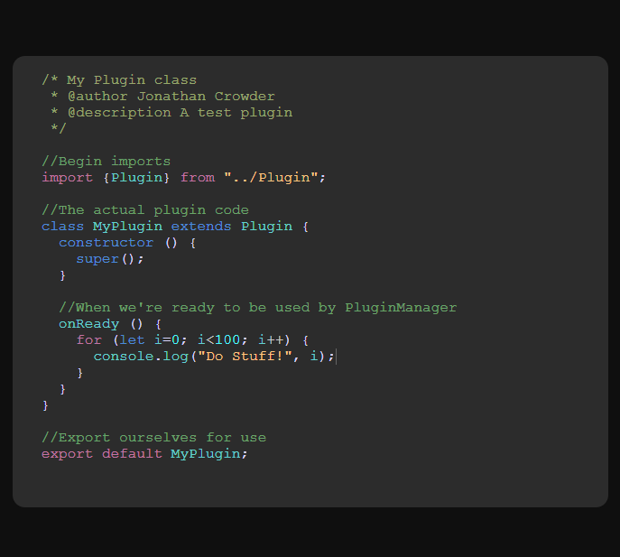

# hylitejs
A work in progress syntax highlighted editor for the browser.

View example online: https://repcomm.github.io/hylitejs/example.html

Planned features:
- JSON Code Language definitions
- Syntax styling preferences
- Custom styles (can already be done with stylus addons for your browser)
- Available offline

